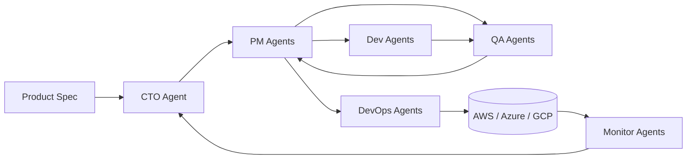
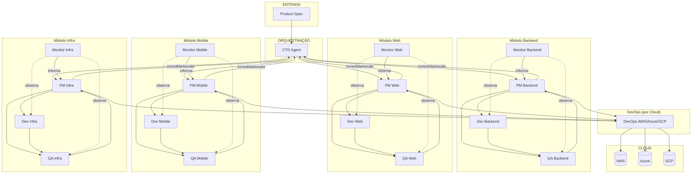

# Zentriz Genesis — Architecture Diagram (Mermaid)

## Diagrama Original (Simplificado)

> Diagrama inicial — mantido para referência histórica. Não reflete a granularidade dos Monitores por módulo nem o fluxo Monitor→PM→CTO.

---

## Diagrama Atualizado (Arquitetura Completa)

> Reflete a arquitetura real: Monitores por módulo (Backend, Web, Mobile, Infra) monitoram **Dev/QA** para progresso e status, informando ao PM. Fluxo de alertas **Monitor → PM → CTO**. Layout: DevOps (por Cloud) e CLOUD posicionados abaixo do Módulo Infra.

---

## Papel do Monitor (por módulo)

**Monitor_<AREA>** (Backend, Web, Mobile, Infra) monitora **Dev_<AREA>** e **QA_<AREA>** do seu módulo para:

- Entender o **progresso** das atividades
- Acompanhar o **status de andamento** (tasks, evidências, bloqueios)
- Detectar travas, loops, falhas recorrentes
- **Informar ao PM_<AREA>** responsável pelo módulo

O PM avalia, toma ação ou escala ao CTO quando crítico.

---

## Fluxo de Alertas (Monitor → PM → CTO)

| Etapa | Agente | Ação |
|-------|--------|------|
| 1 | **Monitor_<AREA>** | Observa **Dev_<AREA>** e **QA_<AREA>** do módulo. Acompanha progresso, status, evidências. Detecta travas, loops, falhas. Gera MONITOR_HEALTH_<area>.md |
| 2 | **Monitor → PM_<AREA>** | Informa progresso e status ao PM responsável. Emite `monitor.alert` quando há risco ou bloqueio |
| 3 | **PM_<AREA>** | Recebe informações, avalia, toma ação ou escala ao CTO |
| 4 | **PM → CTO** | Consolida status, escala alertas críticos, reporta no STATUS.md |