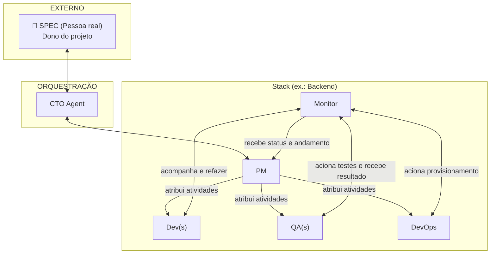
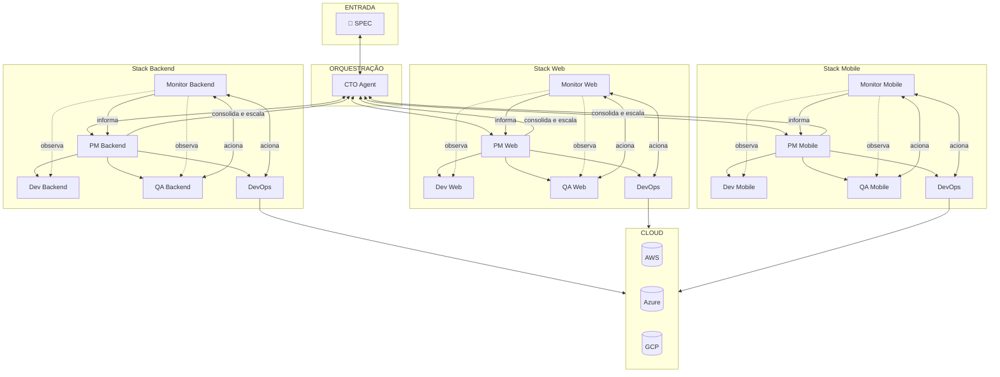
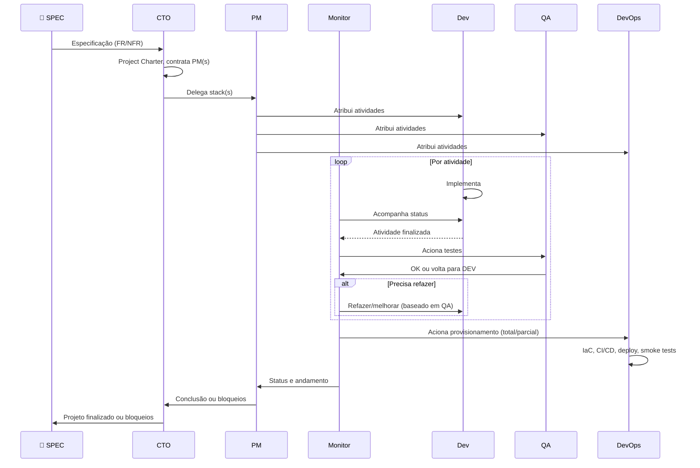
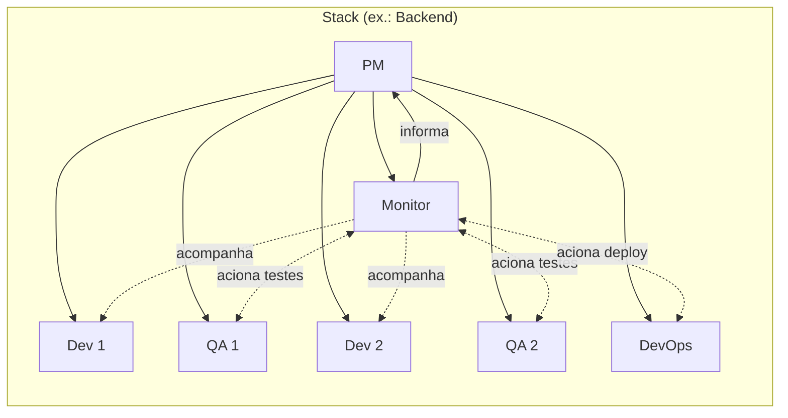
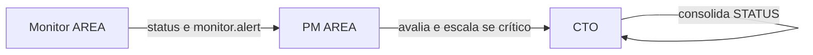

# Zentriz Genesis — Diagramas de Arquitetura (Mermaid)

> Diagramas para compreensão visual do projeto, etapas e responsabilidades dos atores.  
> Detalhamento completo dos atores: [docs/ACTORS_AND_RESPONSIBILITIES.md](docs/ACTORS_AND_RESPONSIBILITIES.md).

---

## 1. Hierarquia de comunicação

Quem se comunica com quem. SPEC (pessoa real) ↔ CTO ↔ PM; PM atribui atividades a Dev, QA e DevOps; Monitor acompanha Dev/QA, aciona QA e DevOps, informa PM.

---

## 2. Arquitetura completa por módulos

Múltiplas stacks (Backend, Web, Mobile). Cada stack: 1 PM, N pares Dev–QA, 1 Monitor, 1 DevOps (por cloud). Infra faz parte de cada stack via DevOps; não existe stack "Infra". Monitor observa Dev/QA, aciona QA e DevOps, informa PM. PM informa CTO.

---

## 3. Fluxo de etapas (sequência)

Da spec à conclusão: SPEC → CTO → PM → atividades (Dev, Monitor aciona QA e DevOps) → Monitor → PM → CTO → SPEC.

---

## 4. Composição da stack (Dev–QA em par, 1 DevOps, 1 Monitor)

Cada stack tem 1 ou N **pares** Dev–QA (1 QA para 1 Dev), **um** DevOps e **um** Monitor. Apenas atores com as mesmas skills.

---

## 5. Resumo de responsabilidades por ator

| Ator | Responsabilidade principal | Comunica com |
|------|----------------------------|--------------|
| **SPEC** | Fornece spec; recebe conclusão/bloqueios | CTO |
| **CTO** | Interpreta spec, Charter, contrata PM(s) | SPEC, PM(s) |
| **PM** | Backlog, gerencia stack, contrata Dev/QA/DevOps/Monitor, atribui atividades | CTO, Dev, QA, DevOps, Monitor (recebe) |
| **Dev** | Implementação contínua | PM (recebe tasks), Monitor (acompanhamento/refazer) |
| **QA** | Testes, documentação, validação, QA Report | PM (recebe tasks), Monitor (acionado para testes) |
| **DevOps** | IaC, CI/CD, deploy, DB, smoke tests | PM (recebe tasks), Monitor (acionado para provisionamento) |
| **Monitor** | Acompanha Dev/QA; aciona QA e DevOps; informa PM | PM, Dev, QA, DevOps |

---

## 6. Fluxo de alertas (Monitor → PM → CTO)

- **Monitor_<AREA>**: Observa Dev_<AREA> e QA_<AREA>; acompanha progresso, status, evidências; detecta travas/loops/falhas; informa PM; emite `monitor.alert` em risco ou bloqueio.
- **PM_<AREA>**: Recebe informações do Monitor; avalia; toma ação ou escala ao CTO quando crítico.
- **CTO**: Recebe consolidação dos PMs e alertas escalados; atualiza STATUS; informa SPEC quando finalizado ou bloqueado.

---

*Última atualização: 2026-02-17 — Zentriz Genesis. Ver [docs/ACTORS_AND_RESPONSIBILITIES.md](docs/ACTORS_AND_RESPONSIBILITIES.md) para detalhes completos.*
