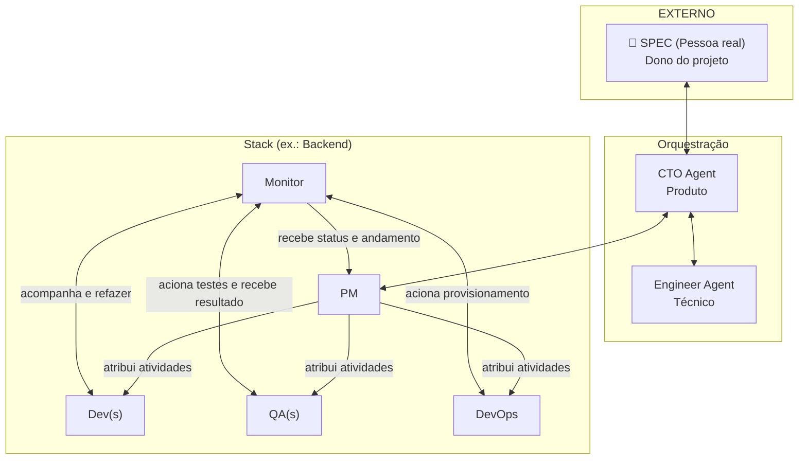
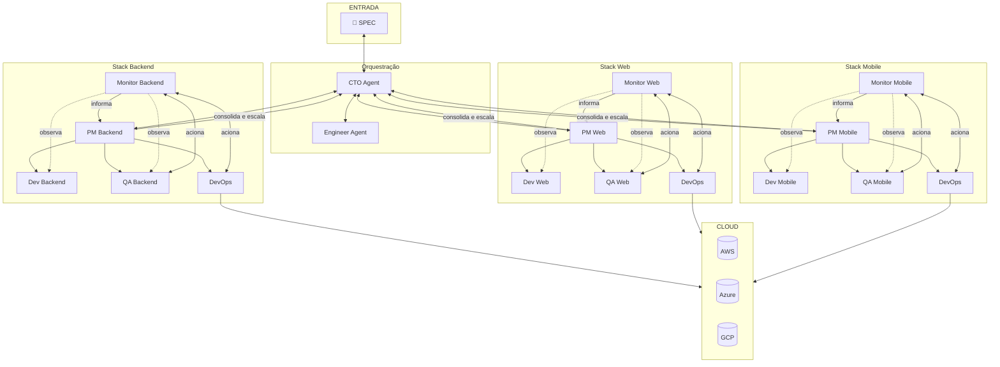
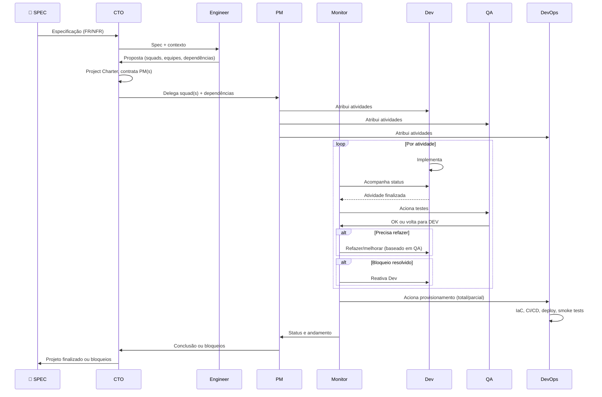
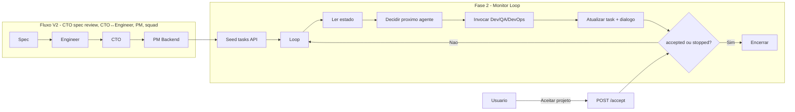
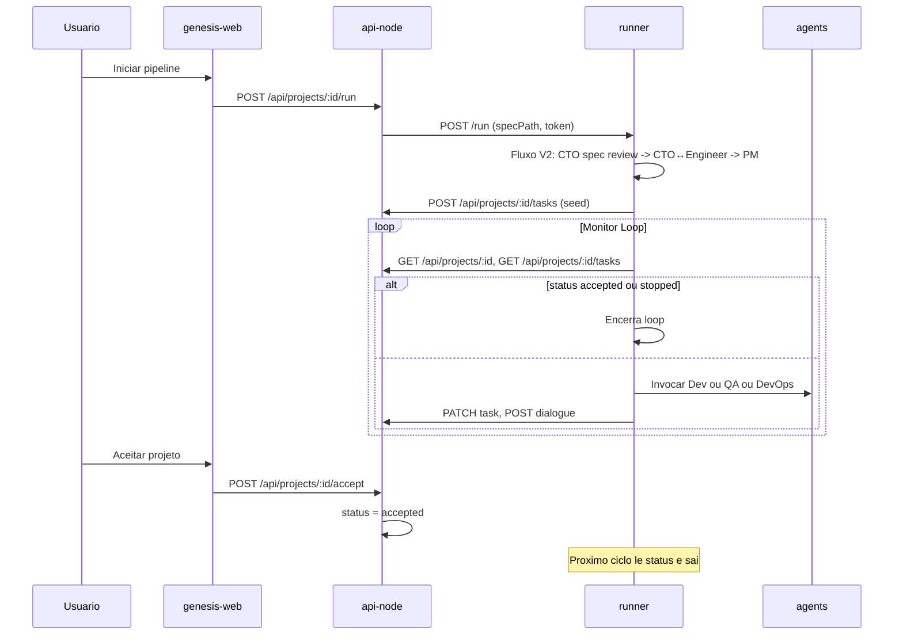
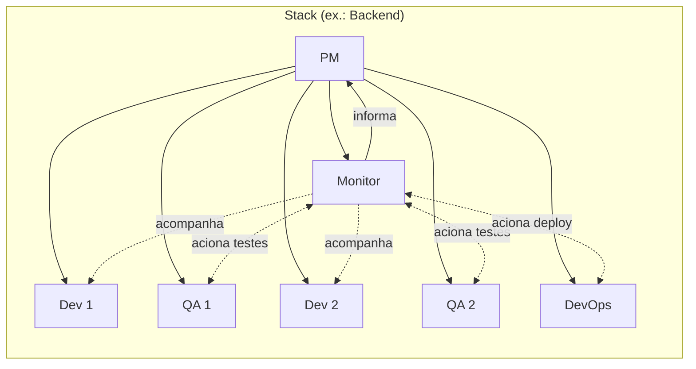
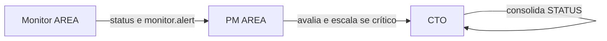
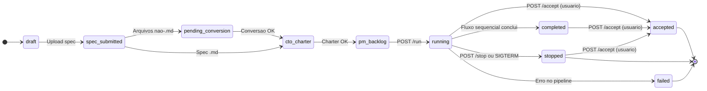

# Zentriz Genesis — Diagramas de Arquitetura (Mermaid)

> Diagramas para compreensão visual do projeto, etapas e responsabilidades dos atores.  
> Detalhamento completo dos atores: [project/docs/ACTORS_AND_RESPONSIBILITIES.md](project/docs/ACTORS_AND_RESPONSIBILITIES.md).

---

## 1. Hierarquia de comunicação

Quem se comunica com quem. SPEC ↔ CTO ↔ **Engineer** (técnico); CTO ↔ PM(s); PMs conversam **via CTO** (dependências). PM atribui atividades a Dev, QA e DevOps; Monitor acompanha Dev/QA, aciona QA e DevOps, informa PM.

---

## 2. Arquitetura completa por módulos

Múltiplas squads (Backend, Web, Mobile) definidas pelo **Engineer**. CTO (produto) e Engineer (técnico) no mesmo nível. Cada squad: 1 PM, N pares Dev–QA, 1 Monitor, 1 DevOps. PMs conversam via CTO (dependências). Monitor observa Dev/QA, aciona QA e DevOps, informa PM.

---

## 3. Fluxo de etapas (sequência conceitual)

Da spec à conclusão: SPEC → CTO → **Engineer** (proposta técnica) → CTO (Charter, contrata PM(s)) → PM → atividades → Monitor aciona Dev/QA/DevOps → PM → CTO → SPEC. O **Monitor** reativa o Dev após bloqueio resolvido (PM/CTO).

---

## 3b. Pipeline em duas fases (implementação atual)

Quando o portal inicia o pipeline (API + PROJECT_ID definidos), o **runner** executa o **fluxo V2**: **CTO spec review** → **loop CTO↔Engineer** (max 3) → Charter → **PM** (módulo backend) → **seed de tarefas** → **Monitor Loop**. O loop só encerra quando o usuário **aceita o projeto** no portal ou **para** o pipeline. Ver [project/docs/PIPELINE_V2_AUTONOMOUS_FLOW_PLAN.md](project/docs/PIPELINE_V2_AUTONOMOUS_FLOW_PLAN.md).

- **Fluxo V2**: CTO spec review → loop CTO↔Engineer → Charter → PM (module) → Runner persiste charter e backlog; chama `POST /api/projects/:id/tasks` para criar tarefas iniciais (ex.: TSK-BE-001).
- **Fase 2**: No mesmo processo, o runner entra em loop: `GET /api/projects/:id` e `GET /api/projects/:id/tasks`; se status for `accepted` ou `stopped`, sai; senão decide próximo agente (Dev, QA ou DevOps), invoca, atualiza task e diálogo; repete. **Parada**: usuário clica "Aceitar projeto" no portal (`POST /api/projects/:id/accept`) ou "Parar" (SIGTERM).

Referência: [project/docs/AGENTS_AND_LLM_FLOW.md](project/docs/AGENTS_AND_LLM_FLOW.md), [project/docs/ORCHESTRATOR_BLUEPRINT.md](project/docs/ORCHESTRATOR_BLUEPRINT.md).

---

## 3c. Fluxo Portal / API / Runner (com aceite)

---

## 4. Composição da squad (Dev–QA em par, 1 DevOps, 1 Monitor)

Cada squad tem 1 ou N **pares** Dev–QA (1 QA para 1 Dev), **um** DevOps e **um** Monitor. Apenas atores com as mesmas skills.

---

## 5. Resumo de responsabilidades por ator

| Ator | Responsabilidade principal | Comunica com |
|------|----------------------------|--------------|
| **SPEC** | Fornece spec; recebe conclusão/bloqueios | CTO |
| **CTO** | Produto: Charter, contrata PM(s), ponte entre PMs (dependências) | SPEC, **Engineer**, PM(s) |
| **Engineer** | Técnico: squads, equipes, dependências; analisa spec | CTO |
| **PM** | Backlog, gerencia squad, contrata Dev/QA/DevOps/Monitor; conversa com outros PMs **via CTO** | CTO, Dev, QA, DevOps, Monitor (recebe) |
| **Dev** | Implementação contínua | PM (recebe tasks), Monitor (acompanhamento/refazer) |
| **QA** | Testes, documentação, validação, QA Report | PM (recebe tasks), Monitor (acionado para testes) |
| **DevOps** | IaC, CI/CD, deploy, DB, smoke tests | PM (recebe tasks), Monitor (acionado para provisionamento) |
| **Monitor** | Acompanha Dev/QA; aciona QA e DevOps; informa PM | PM, Dev, QA, DevOps |

---

## 6. Fluxo de alertas (Monitor → PM → CTO)

- **Monitor_<AREA>**: Observa Dev_<AREA> e QA_<AREA>; acompanha progresso, status, evidências; detecta travas/loops/falhas; informa PM; emite `monitor.alert` em risco ou bloqueio.
- **PM_<AREA>**: Recebe informações do Monitor; avalia; toma ação ou escala ao CTO quando crítico.
- **CTO**: Recebe consolidação dos PMs e alertas escalados; atualiza STATUS; informa SPEC quando finalizado ou bloqueado.

---

## 7. Estados do projeto (API / portal)

Ciclo de vida do status do projeto. O pipeline só encerra (Monitor Loop) quando o usuário **aceita** ou **para**.

- **accepted**: Estado final; usuário clicou em "Aceitar projeto" no portal (`POST /api/projects/:id/accept`). Não permite novo Run.
- **running**: Fluxo V2 em execução (CTO↔Engineer, PM) ou Monitor Loop ativo; runner lê tasks e aciona Dev/QA/DevOps até aceite ou parada.

---

*Última atualização: 2026-02-19 — Zentriz Genesis. Ver [project/docs/ACTORS_AND_RESPONSIBILITIES.md](project/docs/ACTORS_AND_RESPONSIBILITIES.md) e [project/docs/AGENTS_AND_LLM_FLOW.md](project/docs/AGENTS_AND_LLM_FLOW.md) para detalhes completos.*
