# Zentriz Genesis — Diagramas de Arquitetura (Mermaid)

> Diagramas para compreensão visual do projeto, etapas e responsabilidades dos atores.  
> Detalhamento completo dos atores: [project/docs/ACTORS_AND_RESPONSIBILITIES.md](project/docs/ACTORS_AND_RESPONSIBILITIES.md).

---

## 1. Hierarquia de comunicação

Quem se comunica com quem. SPEC ↔ CTO ↔ **Engineer** (técnico); CTO ↔ PM(s); PMs conversam **via CTO** (dependências). PM atribui atividades a Dev, QA e DevOps; Monitor acompanha Dev/QA, aciona QA e DevOps, informa PM.

```mermaid
flowchart TB
    subgraph EXTERNO
        SPEC["👤 SPEC (Pessoa real)<br/>Dono do projeto"]
    end

    subgraph ORQUESTRAÇÃO["Orquestração"]
        CTO["CTO Agent<br/>Produto"]
        ENG["Engineer Agent<br/>Técnico"]
    end

    subgraph STACK["Stack (ex.: Backend)"]
        PM["PM"]
        DEV["Dev(s)"]
        QA["QA(s)"]
        MON["Monitor"]
        DEVOPS["DevOps"]
    end

    SPEC <--> CTO
    CTO <--> ENG
    CTO <--> PM
    PM -->|atribui atividades| DEV
    PM -->|atribui atividades| QA
    PM -->|atribui atividades| DEVOPS
    MON -->|recebe status e andamento| PM

    MON <-->|acompanha e refazer| DEV
    MON <-->|aciona testes e recebe resultado| QA
    MON <-->|aciona provisionamento| DEVOPS
```

---

## 2. Arquitetura completa por módulos

Múltiplas squads (Backend, Web, Mobile) definidas pelo **Engineer**. CTO (produto) e Engineer (técnico) no mesmo nível. Cada squad: 1 PM, N pares Dev–QA, 1 Monitor, 1 DevOps. PMs conversam via CTO (dependências). Monitor observa Dev/QA, aciona QA e DevOps, informa PM.

```mermaid
flowchart TB
    subgraph ENTRADA
        SPEC["👤 SPEC"]
    end

    subgraph ORQUESTRAÇÃO["Orquestração"]
        CTO["CTO Agent"]
        ENG["Engineer Agent"]
    end

    subgraph MÓDULO_BACKEND["Stack Backend"]
        PM_BE[PM Backend]
        DEV_BE[Dev Backend]
        QA_BE[QA Backend]
        MON_BE[Monitor Backend]
        DEVOPS_BE[DevOps]
    end

    subgraph MÓDULO_WEB["Stack Web"]
        PM_WEB[PM Web]
        DEV_WEB[Dev Web]
        QA_WEB[QA Web]
        MON_WEB[Monitor Web]
        DEVOPS_WEB[DevOps]
    end

    subgraph MÓDULO_MOBILE["Stack Mobile"]
        PM_MOB[PM Mobile]
        DEV_MOB[Dev Mobile]
        QA_MOB[QA Mobile]
        MON_MOB[Monitor Mobile]
        DEVOPS_MOB[DevOps]
    end

    subgraph CLOUD
        AWS[(AWS)]
        AZURE[(Azure)]
        GCP[(GCP)]
    end

    SPEC <--> CTO
    CTO <--> ENG
    CTO <--> PM_BE
    CTO <--> PM_WEB
    CTO <--> PM_MOB

    PM_BE --> DEV_BE
    PM_BE --> QA_BE
    PM_BE --> DEVOPS_BE
    PM_WEB --> DEV_WEB
    PM_WEB --> QA_WEB
    PM_WEB --> DEVOPS_WEB
    PM_MOB --> DEV_MOB
    PM_MOB --> QA_MOB
    PM_MOB --> DEVOPS_MOB

    MON_BE -.->|observa| DEV_BE
    MON_BE -.->|observa| QA_BE
    MON_BE <-->|aciona| QA_BE
    MON_BE <-->|aciona| DEVOPS_BE
    MON_BE -->|informa| PM_BE

    MON_WEB -.->|observa| DEV_WEB
    MON_WEB -.->|observa| QA_WEB
    MON_WEB <-->|aciona| QA_WEB
    MON_WEB <-->|aciona| DEVOPS_WEB
    MON_WEB -->|informa| PM_WEB

    MON_MOB -.->|observa| DEV_MOB
    MON_MOB -.->|observa| QA_MOB
    MON_MOB <-->|aciona| QA_MOB
    MON_MOB <-->|aciona| DEVOPS_MOB
    MON_MOB -->|informa| PM_MOB

    DEVOPS_BE --> CLOUD
    DEVOPS_WEB --> CLOUD
    DEVOPS_MOB --> CLOUD

    PM_BE -->|consolida e escala| CTO
    PM_WEB -->|consolida e escala| CTO
    PM_MOB -->|consolida e escala| CTO
```

---

## 3. Fluxo de etapas (sequência conceitual)

Da spec à conclusão: SPEC → CTO → **Engineer** (proposta técnica) → CTO (Charter, contrata PM(s)) → PM → atividades → Monitor aciona Dev/QA/DevOps → PM → CTO → SPEC. O **Monitor** reativa o Dev após bloqueio resolvido (PM/CTO).

```mermaid
sequenceDiagram
    participant SPEC as 👤 SPEC
    participant CTO as CTO
    participant ENG as Engineer
    participant PM as PM
    participant MON as Monitor
    participant DEV as Dev
    participant QA as QA
    participant DO as DevOps

    SPEC->>CTO: Especificação (FR/NFR)
    CTO->>ENG: Spec + contexto
    ENG->>CTO: Proposta (squads, equipes, dependências)
    CTO->>CTO: Project Charter, contrata PM(s)
    CTO->>PM: Delega squad(s) + dependências

    PM->>DEV: Atribui atividades
    PM->>QA: Atribui atividades
    PM->>DO: Atribui atividades

    loop Por atividade
        DEV->>DEV: Implementa
        MON->>DEV: Acompanha status
        DEV-->>MON: Atividade finalizada
        MON->>QA: Aciona testes
        QA->>MON: OK ou volta para DEV
        alt Precisa refazer
            MON->>DEV: Refazer/melhorar (baseado em QA)
        end
        alt Bloqueio resolvido
            MON->>DEV: Reativa Dev
        end
    end

    MON->>DO: Aciona provisionamento (total/parcial)
    DO->>DO: IaC, CI/CD, deploy, smoke tests
    MON->>PM: Status e andamento
    PM->>CTO: Conclusão ou bloqueios
    CTO->>SPEC: Projeto finalizado ou bloqueios
```



---

## 3b. Pipeline em duas fases (implementação atual)

Quando o portal inicia o pipeline (API + PROJECT_ID definidos), o **runner** executa o **fluxo V2**: **CTO spec review** → **loop CTO↔Engineer** (max 3) → Charter → **PM** (módulo backend) → **seed de tarefas** → **Monitor Loop**. O loop só encerra quando o usuário **aceita o projeto** no portal ou **para** o pipeline. Ver [project/docs/PIPELINE_V2_AUTONOMOUS_FLOW_PLAN.md](project/docs/PIPELINE_V2_AUTONOMOUS_FLOW_PLAN.md).


- **Fluxo V2**: CTO spec review → loop CTO↔Engineer → Charter → PM (module) → Runner persiste charter e backlog; chama `POST /api/projects/:id/tasks` para criar tarefas iniciais (ex.: TSK-BE-001).
- **Fase 2**: No mesmo processo, o runner entra em loop: `GET /api/projects/:id` e `GET /api/projects/:id/tasks`; se status for `accepted` ou `stopped`, sai; senão decide próximo agente (Dev, QA ou DevOps), invoca, atualiza task e diálogo; repete. **Parada**: usuário clica "Aceitar projeto" no portal (`POST /api/projects/:id/accept`) ou "Parar" (SIGTERM).

Referência: [project/docs/AGENTS_AND_LLM_FLOW.md](project/docs/AGENTS_AND_LLM_FLOW.md), [project/docs/ORCHESTRATOR_BLUEPRINT.md](project/docs/ORCHESTRATOR_BLUEPRINT.md).

---

## 3c. Fluxo Portal / API / Runner (com aceite)


---

## 4. Composição da squad (Dev–QA em par, 1 DevOps, 1 Monitor)

Cada squad tem 1 ou N **pares** Dev–QA (1 QA para 1 Dev), **um** DevOps e **um** Monitor. Apenas atores com as mesmas skills.


---

## 5. Resumo de responsabilidades por ator

| Ator | Responsabilidade principal | Comunica com |
|------|----------------------------|--------------|
| **SPEC** | Fornece spec; recebe conclusão/bloqueios | CTO |
| **CTO** | Produto: Charter, contrata PM(s), ponte entre PMs (dependências) | SPEC, **Engineer**, PM(s) |
| **Engineer** | Técnico: squads, equipes, dependências; analisa spec | CTO |
| **PM** | Backlog, gerencia squad, contrata Dev/QA/DevOps/Monitor; conversa com outros PMs **via CTO** | CTO, Dev, QA, DevOps, Monitor (recebe) |
| **Dev** | Implementação contínua | PM (recebe tasks), Monitor (acompanhamento/refazer) |
| **QA** | Testes, documentação, validação, QA Report | PM (recebe tasks), Monitor (acionado para testes) |
| **DevOps** | IaC, CI/CD, deploy, DB, smoke tests | PM (recebe tasks), Monitor (acionado para provisionamento) |
| **Monitor** | Acompanha Dev/QA; aciona QA e DevOps; informa PM | PM, Dev, QA, DevOps |

---

## 6. Fluxo de alertas (Monitor → PM → CTO)

```mermaid
flowchart LR
    MON["Monitor AREA"]
    PM["PM AREA"]
    CTO["CTO"]

    MON -->|status e monitor.alert| PM
    PM -->|avalia e escala se crítico| CTO
    CTO -->|consolida STATUS| CTO
```



- **Monitor_<AREA>**: Observa Dev_<AREA> e QA_<AREA>; acompanha progresso, status, evidências; detecta travas/loops/falhas; informa PM; emite `monitor.alert` em risco ou bloqueio.
- **PM_<AREA>**: Recebe informações do Monitor; avalia; toma ação ou escala ao CTO quando crítico.
- **CTO**: Recebe consolidação dos PMs e alertas escalados; atualiza STATUS; informa SPEC quando finalizado ou bloqueado.

---

## 7. Estados do projeto (API / portal)

Ciclo de vida do status do projeto. O pipeline só encerra (Monitor Loop) quando o usuário **aceita** ou **para**.


- **accepted**: Estado final; usuário clicou em "Aceitar projeto" no portal (`POST /api/projects/:id/accept`). Não permite novo Run.
- **running**: Fluxo V2 em execução (CTO↔Engineer, PM) ou Monitor Loop ativo; runner lê tasks e aciona Dev/QA/DevOps até aceite ou parada.

---

*Última atualização: 2026-02-19 — Zentriz Genesis. Ver [project/docs/ACTORS_AND_RESPONSIBILITIES.md](project/docs/ACTORS_AND_RESPONSIBILITIES.md) e [project/docs/AGENTS_AND_LLM_FLOW.md](project/docs/AGENTS_AND_LLM_FLOW.md) para detalhes completos.*
