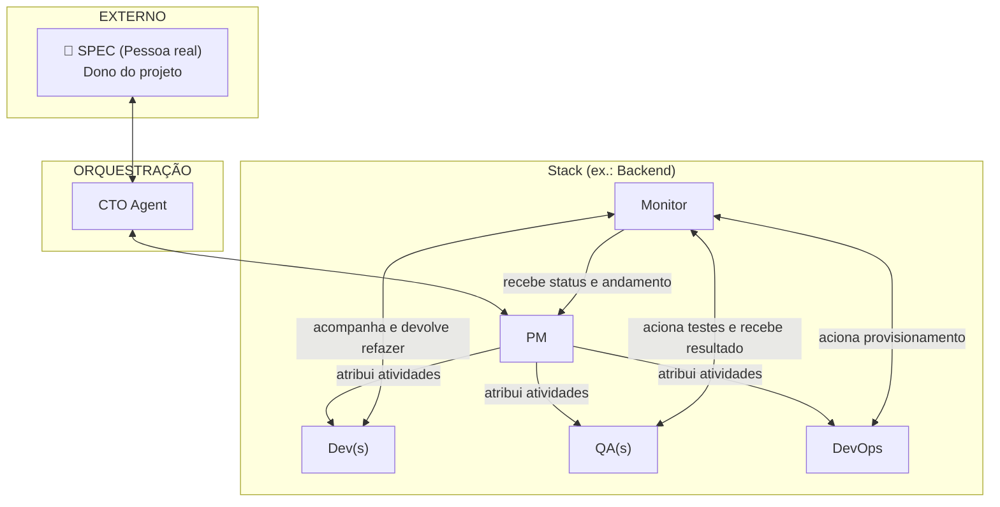
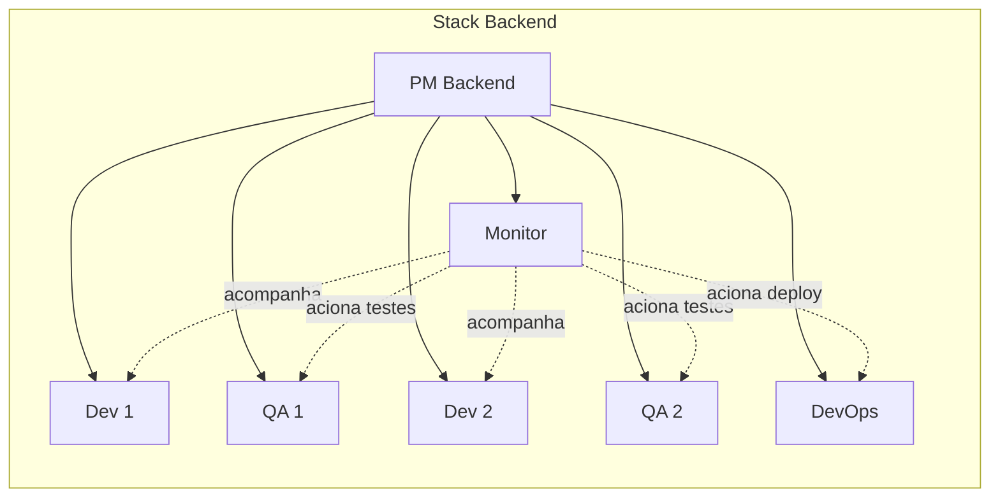
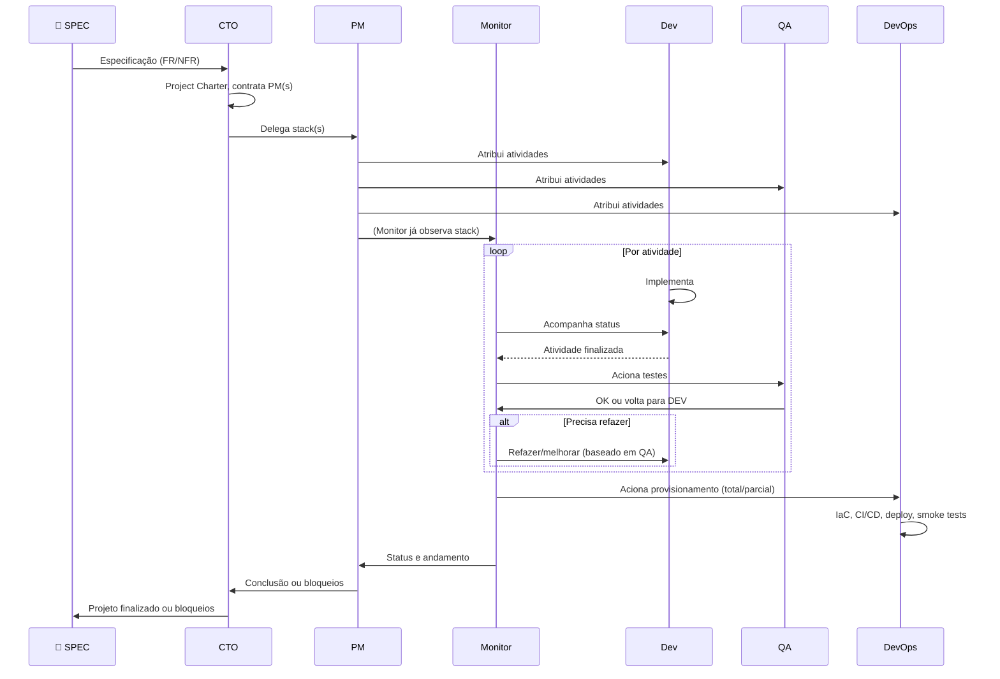
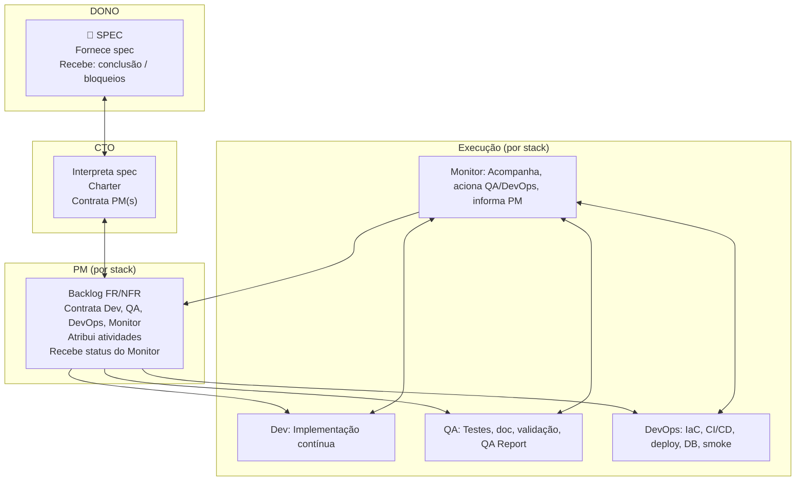

# Atores e Responsabilidades — Zentriz Genesis

> **Propósito**: Definir de forma clara e objetiva os atores do sistema, suas responsabilidades, comportamentos e a hierarquia de comunicação. Documento de referência para desenvolvimento de agentes, orquestrador, infra, reports e spec.

---

## 1. Visão geral dos Atores

| Ator | Tipo | Responsabilidade em uma frase |
|------|------|------------------------------|
| **SPEC** | Pessoa real | Dono do projeto; fornece especificação e requisitos; recebe status de conclusão ou bloqueios. |
| **CTO** | Agente | Interpreta a spec, gera Project Charter, contrata PM(s) por skills; informa SPEC quando projeto finalizado ou bloqueado. |
| **PM** | Agente | Gerencia sua stack; backlog por FR/NFR; contrata Dev(s), QA(s), DevOps e Monitor da stack; recebe status do Monitor. |
| **Dev** | Agente | Especialista em desenvolvimento contínuo; implementação de tarefas conforme skills da atividade. |
| **QA** | Agente | Especialista em testes, documentação, validação contínua, QA Report; bloqueia regressões. |
| **DevOps** | Agente | Especialista em IaC, CI/CD, deploy, smoke tests, banco de dados; provisiona infra total ou parcial. |
| **Monitor** | Agente | Especialista em acompanhamento; monitora Dev/QA; aciona QA para testes e DevOps para provisionamento; informa PM. |

---

## 2. Hierarquia de comunicação

Cada ator comunica-se **apenas** com os atores indicados abaixo. Respeitar essa hierarquia garante rastreabilidade e evita ruído.

### Tabela de comunicação permitida

| Origem → Destino | SPEC | CTO | PM | Dev | QA | DevOps | Monitor |
|------------------|------|-----|----|-----|-----|--------|---------|
| **SPEC** | — | bidirecional | — | — | — | — | — |
| **CTO** | bidirecional | — | bidirecional | — | — | — | — |
| **PM** | — | bidirecional | — | atribui atividades | atribui atividades | atribui atividades | recebe status |
| **Dev** | — | — | via PM | — | — | — | com Monitor (acompanhamento) |
| **QA** | — | — | via PM | — | — | — | com Monitor (testes) |
| **DevOps** | — | — | via PM | — | — | — | com Monitor (provisionamento) |
| **Monitor** | — | — | informa status | acompanha e devolve refazer | aciona testes e recebe resultado | aciona provisionamento | — |

---

## 3. Responsabilidades e comportamentos por ator

### 3.1 SPEC (Pessoa real — dono do projeto)

- **Responsabilidade**: Fornecer a documentação e especificação de requisitos (FR/NFR); ser o dono do projeto.
- **Comportamentos**:
  - Entrega e mantém o documento de spec (ex.: [spec/PRODUCT_SPEC.md](../spec/PRODUCT_SPEC.md)).
  - Não dialoga com PM, Dev, QA, DevOps ou Monitor — apenas com o CTO.
  - Recebe do CTO: notificação de **projeto finalizado** ou **bloqueios** que exijam decisão de negócio.

---

### 3.2 CTO (Agente)

- **Responsabilidade**: Interpretar a spec, gerar Project Charter, **contratar** um ou mais PMs com base nas skills necessárias para o projeto.
- **Comportamentos**:
  - Lê a spec e produz [docs/PROJECT_CHARTER.md](PROJECT_CHARTER.md).
  - Define quais stacks são necessárias (Backend, Web, Mobile). A infraestrutura faz parte de cada stack via DevOps.
  - Contrata (instancia) um PM por stack necessária.
  - Delega o escopo da stack ao PM; não atribui tarefas diretamente a Dev/QA/DevOps/Monitor.
  - Recebe do PM: conclusão do projeto da stack ou bloqueios.
  - Informa ao **SPEC** quando o projeto está finalizado ou quando há bloqueios que exigem decisão.
  - Mantém [docs/STATUS.md](STATUS.md) consolidado.

---

### 3.3 PM (Agente — por stack)

- **Responsabilidade**: Backlog por FR/NFR; gerenciar sua stack; **contratar** os atores da stack: um ou mais Dev e QA (sempre em par: 1 QA para 1 Dev), **um** DevOps e **um** Monitor por projeto/stack.
- **Comportamentos**:
  - Cria e mantém o backlog (tasks com FR/NFR) para sua stack.
  - Contrata atores **com as mesmas skills** da stack (ex.: stack Backend → Dev Backend, QA Backend, DevOps, Monitor Backend).
  - Tamanho da stack: 1 ou vários Dev(s) e QA(s), conforme complexidade; sempre **pares** Dev–QA. Apenas **um** DevOps e **um** Monitor por stack.
  - Comunica-se com Dev, QA e DevOps **apenas para atribuir atividades** (tasks).
  - Recebe do **Monitor** o status do andamento do desenvolvimento e da finalização das atividades.
  - Não recebe resultado de testes diretamente do QA — o Monitor orquestra Dev ↔ QA e informa o PM.
  - Informa ao CTO quando o projeto da stack foi finalizado ou há bloqueios.
  - Usa [contracts/pm_backlog_template.md](../contracts/pm_backlog_template.md) e [docs/DEVOPS_SELECTION.md](DEVOPS_SELECTION.md) para escolher DevOps por cloud.

---

### 3.4 Dev (Agente)

- **Responsabilidade**: Desenvolvimento contínuo de tarefas baseadas nas skills da atividade; **implementação**.
- **Comportamentos**:
  - Recebe atividades do PM (não do CTO nem do SPEC).
  - Implementa código, testes unitários e documentação conforme FR/NFR.
  - É **acompanhado** pelo Monitor (progresso, status).
  - Quando finaliza uma atividade, o **Monitor** aciona o QA para testes.
  - Se o QA reportar problemas, o **Monitor** informa ao Dev para refazer ou melhorar; o Dev não dialoga diretamente com o QA para essa orquestração.
  - Entrega evidências (arquivos, logs, resultados de testes) conforme [contracts/global_definition_of_done.md](../contracts/global_definition_of_done.md).

---

### 3.5 QA (Agente)

- **Responsabilidade**: Testes, documentação, validação contínua, QA Report, bloqueio a regressões.
- **Comportamentos**:
  - Recebe atividades do PM (o que validar).
  - É **acionado pelo Monitor** para realizar testes em atividades finalizadas pelo Dev.
  - Envia ao Monitor: resultado **OK** ou **precisa voltar para o Dev** (com relatório acionável).
  - Produz relatório seguindo [reports/QA_REPORT_TEMPLATE.md](../reports/QA_REPORT_TEMPLATE.md).
  - Bloqueia regressões (QA_FAIL com referência a FR/NFR e evidência).

---

### 3.6 DevOps (Agente)

- **Responsabilidade**: IaC, CI/CD, deploy, smoke tests; provisionar **toda** a infraestrutura, incluindo banco de dados. Especialista também em banco de dados.
- **Comportamentos**:
  - Recebe atividades do PM.
  - É **acionado pelo Monitor** para realizar provisionamento da aplicação — **total** ou **parcial** (parcial quando já existir produto funcional parcialmente).
  - Entrega: IaC, pipeline CI/CD, deploy, smoke tests pós-deploy, runbook.
  - Responsável por infra de banco de dados (esquema, migrações, backups quando aplicável).
  - Usa [contracts/devops_definition_of_done.md](../contracts/devops_definition_of_done.md) e [tests/smoke/](../tests/smoke/).

---

### 3.7 Monitor (Agente)

- **Responsabilidade**: Acompanhamento e monitoramento das atividades; orquestrar fluxo Dev → QA e acionar DevOps; informar PM; PM escala ao CTO quando crítico.
- **Comportamentos**:
  - **Monitor ↔ Dev**: Acompanha o desenvolvimento das atividades; informa ao PM o status; **informa ao Dev** quando precisa refazer ou melhorar uma atividade (com base no relatório do QA).
  - **Monitor ↔ QA**: **Aciona** o QA para realizar testes em atividades finalizadas pelo Dev; **recebe** do QA: está tudo OK ou precisa voltar para o Dev.
  - **Monitor ↔ DevOps**: **Aciona** o DevOps para provisionamento (total ou parcial).
  - **Monitor → PM**: Informa status do andamento e finalização das atividades; emite `monitor.alert` em risco ou bloqueio.
  - PM avalia e escala ao CTO quando crítico.
  - Gera [reports/MONITOR_HEALTH_TEMPLATE.md](../reports/MONITOR_HEALTH_TEMPLATE.md) por área.

---

## 4. Composição da stack

- Cada **stack** (Backend, Web, Mobile) é formada **apenas por atores com as mesmas skills** (ex.: Backend → dev/backend/nodejs, qa/backend/nodejs ou lambdas, monitor/backend; DevOps por cloud: devops/aws, devops/azure, devops/gcp). Não existe stack "Infra" — a infra está dentro de cada stack (DevOps). Estrutura: [agents/README.md](../agents/README.md).
- **Dev e QA**: sempre em **par** (1 QA para 1 Dev). Pode haver **1 ou N** pares por stack, conforme tamanho e complexidade.
- **DevOps**: **um** por projeto/stack (escolhido por cloud: AWS, Azure ou GCP).
- **Monitor**: **um** por stack.
- O **PM** contrata e atribui atividades; não executa tarefas de Dev/QA/DevOps.

---

## 5. Fluxo de etapas (visão de alto nível)

---

## 6. Diagrama de responsabilidades (resumo visual)

---

## 7. Referências rápidas

| Tema | Documento |
|------|------------|
| Charter e módulos | [docs/PROJECT_CHARTER.md](PROJECT_CHARTER.md) |
| Backlog e tasks | [docs/PM_AUTOBACKLOG_GUIDE.md](PM_AUTOBACKLOG_GUIDE.md), [contracts/pm_backlog_template.md](../contracts/pm_backlog_template.md) |
| DoD global | [contracts/global_definition_of_done.md](../contracts/global_definition_of_done.md) |
| DoD DevOps | [contracts/devops_definition_of_done.md](../contracts/devops_definition_of_done.md) |
| Seleção DevOps | [docs/DEVOPS_SELECTION.md](DEVOPS_SELECTION.md) |
| Eventos e orquestração | [docs/ORCHESTRATOR_BLUEPRINT.md](ORCHESTRATOR_BLUEPRINT.md), [docs/TASK_STATE_MACHINE.md](TASK_STATE_MACHINE.md) |
| Diagramas de arquitetura | [ARCHITECTURE_DIAGRAM.md](../ARCHITECTURE_DIAGRAM.md) |
| Capacidades dos agentes | [docs/AGENTS_CAPABILITIES.md](AGENTS_CAPABILITIES.md) |

---

*Documento criado em 2026-02-17 — Zentriz Genesis. Referência para desenvolvimento de agentes, orquestrador, infra, reports, scripts, services, spec e tests.*
