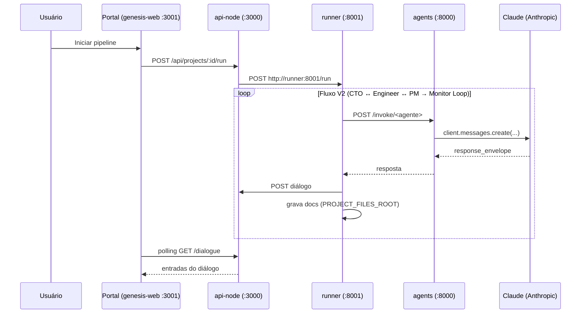

# Fluxo: Agentes conversando com a LLM (Claude)

> Visão em profundidade de como o portal dispara o pipeline e onde cada agente (Engineer, CTO, PM, Dev, QA, Monitor, DevOps) fala com a API Claude.

---

## 1. Visão em uma frase

O **portal (genesis-web)** permite ao usuário enviar uma spec e **iniciar** o pipeline. A **API (api-node)** chama o **Runner**; o Runner executa o **fluxo V2**: (1) **CTO spec review** — converte/entende a spec e grava em docs; (2) **loop CTO↔Engineer** (max 3 rodadas) — proposta técnica (squads/skills), CTO valida ou questiona até Charter; (3) **PM** (módulo backend, charter + proposta) — gera backlog; (4) **seed de tarefas** e **Monitor Loop** — runner lê estado das tasks, aciona Dev/QA/DevOps, atualiza tarefas e diálogo, grava artefatos com `path` em `project/`, até o usuário **aceitar** ou **parar**. Cada agente roda no serviço **agents** (Python/FastAPI), que chama a **API da Anthropic (Claude)**. Ver [PIPELINE_V2_AUTONOMOUS_FLOW_PLAN.md](PIPELINE_V2_AUTONOMOUS_FLOW_PLAN.md).

Sem API/PROJECT_ID, o runner usa fluxo sequencial (Spec → CTO → Engineer loop → PM → Dev → QA → Monitor → DevOps). Documentos e artefatos são persistidos em `<PROJECT_FILES_ROOT>/<project_id>/docs/` e `.../project/` quando definido.

---

## 2. Sequência completa



- O **único** serviço que usa `CLAUDE_API_KEY` e `CLAUDE_MODEL` para falar com a LLM é o **agents**.
- O **runner** chama os agents via HTTP e grava passos/erros no diálogo via API. Fluxo V2: CTO spec review → loop CTO↔Engineer → PM (módulo backend) → seed de tarefas → **Monitor Loop**: a cada ciclo lê projeto e tasks; se `accepted` ou `stopped`, encerra; senão aciona Dev/QA/DevOps, atualiza task e persiste artefatos (Dev e DevOps com `path` em `.../project/`). O loop só para quando o usuário **Aceitar projeto** ou **Parar** (SIGTERM).
- O **portal** faz polling GET `/api/projects/:id/dialogue` e exibe as entradas; exibe o botão **Aceitar projeto** quando status é `completed` ou `running`, chamando POST `/api/projects/:id/accept`. Pode listar documentos via GET `/api/projects/:id/artifacts` (quando `PROJECT_FILES_ROOT` está definido na API).

---

## 3. Ordem do pipeline (fluxo V2)

| Ordem | Agente        | Endpoint (agents)     | Entrada principal                    | Saída principal        |
|-------|---------------|-----------------------|--------------------------------------|-------------------------|
| 0     | (Spec)        | —                     | Arquivo enviado pelo usuário         | —                       |
| 1     | CTO           | POST /invoke/cto      | spec (engineer_proposal vazio)       | Spec entendida / revisada |
| 2     | Engineer      | POST /invoke/engineer | spec_understood (+ cto_questionamentos se rodada >1) | Proposta técnica |
| 3     | CTO           | POST /invoke/cto      | engineer_proposal                    | Charter ou questionamentos (loop max 3) |
| 4     | PM            | POST /invoke/pm       | charter_summary, module, engineer_proposal | Backlog                 |
| 5     | Dev           | POST /invoke/dev      | backlog + charter                    | Implementação (artifacts com path → project/) |
| 6     | QA            | POST /invoke/qa       | backlog + artefatos Dev             | Relatório QA            |
| 7     | Monitor       | (loop no runner)      | estado projeto/tasks                | Decisão Dev/QA/DevOps  |
| 8     | DevOps        | POST /invoke/devops   | charter + backlog + artefatos       | Dockerfile / compose (artifacts com path → project/) |

Cada passo persiste no diálogo; com `PROJECT_FILES_ROOT`, artefatos em `<project_id>/docs/` e, quando têm `path`, em `<project_id>/project/`.

---

## 4. Onde cada peça vive

| Componente | Repositório / container | Responsabilidade |
|------------|-------------------------|-------------------|
| Portal | genesis-web (Next.js) | UI: upload de spec, botão Iniciar/Parar, exibição do diálogo (passos e erros). |
| API | api-node (Node/Fastify) | Autenticação, projetos, upload de spec, **POST /api/projects/:id/run** → chama runner; **GET /api/projects/:id/artifacts** → lista docs do projeto (manifest em PROJECT_FILES_ROOT). |
| Runner | runner (Python) | Orquestração V2: **CTO spec review** → **loop CTO↔Engineer** (max 3) → **PM** (module + charter) → seed tasks → **Monitor Loop** (Dev/QA/DevOps); persiste diálogo e docs/ + project/ por project_id. |
| Agentes | agents (Python/FastAPI) | Endpoints `/invoke/engineer`, `/invoke/cto`, `/invoke`, `/invoke/dev-backend`, `/invoke/qa-backend`, `/invoke/monitor`, `/invoke/devops-docker`. Chama **Claude** via `runtime.run_agent()` e devolve `response_envelope`. |
| Runtime LLM | orchestrator/agents/runtime.py | `run_agent()` → Anthropic SDK → `client.messages.create(model=CLAUDE_MODEL, ...)`. Retry, extrai mensagem de erro. |
| Diálogo | orchestrator/dialogue.py | Templates em português, POST no endpoint `/api/projects/:id/dialogue`. |
| Claude | API Anthropic | LLM que gera as respostas (proposta técnica, charter, backlog, implementação, QA, monitor, DevOps). |

---

## 5. Como executar

### Modo host-agents (Docker Desktop Mac — recomendado)

**Terminal 1:**
```bash
./deploy-docker.sh --host-agents --force-recreate
```
Sobe: api, genesis-web, runner, postgres, redis. O agents **não** sobe no Docker.

**Terminal 2:**
```bash
./start-agents-host.sh
```
Sobe os agentes no host (porta 8000). Carrega `.env` automaticamente. O runner no Docker chama `http://host.docker.internal:8000`.

### Modo Docker completo (Linux / onde TLS funciona)

```bash
./deploy-docker.sh --force-recreate
```

---

## 6. Variáveis que importam

| Variável | Container | Valor correto |
|----------|-----------|----------------|
| `CLAUDE_API_KEY` | agents (ou host) | Chave da API Anthropic (`.env`) |
| `CLAUDE_MODEL` | agents (ou host) | `claude-sonnet-4-6` (ativo) |
| `API_BASE_URL` | runner | `http://api:3000` (**NÃO** `localhost` — causa Connection refused) |
| `API_AGENTS_URL` | runner | `http://agents:8000` ou `http://host.docker.internal:8000` |
| `PROJECT_FILES_ROOT` | runner, api | Raiz dos arquivos por projeto (ex.: `/project-files` no container; no host `/Users/mac/zentriz-files`). Se definido, runner grava docs em `<root>/<project_id>/docs` e artefatos em `.../project`; API serve GET /api/projects/:id/artifacts. |
| `PIPELINE_FULL_STACK` | runner | `true` = pipeline completo (Dev, QA, Monitor, DevOps); `false` = só Engineer → CTO → PM Backend. |
| `SHOW_TRACEBACK` | agents, runner | `true` (dev, traceback completo) / `false` (prod, só mensagem humana) |
| `RUNNER_SERVICE_URL` | api | `http://runner:8001` (definido no compose) |

---

## 7. Diagnóstico rápido

- **Logs dos agentes (quem fala com a Claude):**  
  Host: veja o terminal de `./start-agents-host.sh`.  
  Docker: `docker compose logs agents`.  
  Deve aparecer: `CLAUDE_MODEL=claude-sonnet-4-6 | CLAUDE_API_KEY (definida) | SHOW_TRACEBACK ativado`.
- **Health do agents:**  
  `curl -s http://127.0.0.1:8000/health`  
  Resposta: `"claude_model": "claude-sonnet-4-6"`, `"claude_configured": true`.
- **Diálogo gravado no banco?**  
  `docker compose exec postgres psql -U genesis -d zentriz_genesis -c "SELECT from_agent, event_type, LEFT(summary_human,80) FROM project_dialogue ORDER BY created_at DESC LIMIT 10;"`
- **Logs do runner (passos e erros):**  
  `docker compose logs runner --tail=50`  
  Se aparecer `Connection refused`, verificar que `API_BASE_URL=http://api:3000`.
- **Documentos por projeto (PROJECT_FILES_ROOT):**  
  No host: `ls <PROJECT_FILES_ROOT>/<project_id>/docs/`.  
  Na API: `GET /api/projects/:id/artifacts` (retorna `docs`, `projectDocsRoot`, `projectArtifactsRoot`).
- **Teste de conectividade Claude (sem Docker):**  
  `python tests/python/test_claude_connection.py`

---

## 8. Referências

- Lista completa de variáveis e troubleshooting: [SECRETS_AND_ENV.md](SECRETS_AND_ENV.md).
- Plano do pipeline squad completa e armazenamento: [PIPELINE_FULL_STACK_IMPLEMENTATION_PLAN.md](PIPELINE_FULL_STACK_IMPLEMENTATION_PLAN.md).
- Runner e fluxo spec → CTO → PM → Dev → QA → Monitor → DevOps: [ORCHESTRATION_GUIDE.md](ORCHESTRATION_GUIDE.md) e `applications/orchestrator/runner.py`.
- Runtime e retry: `applications/orchestrator/agents/runtime.py`.
- Servidor de agentes: `applications/orchestrator/agents/server.py`.
- Diálogo (templates, POST): `applications/orchestrator/dialogue.py`.
- Armazenamento por projeto: `applications/orchestrator/project_storage.py`.
