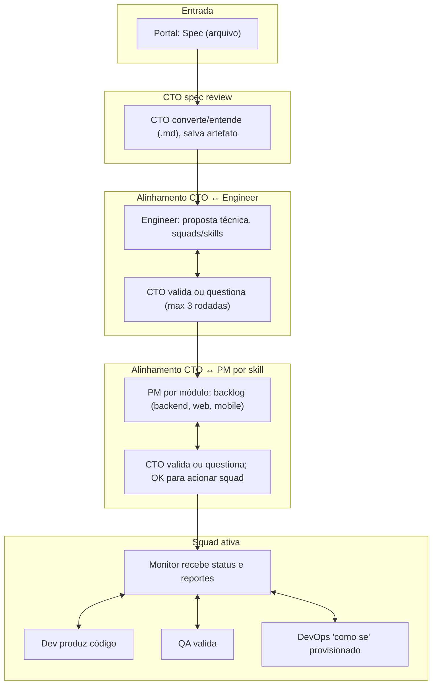

# Plano: Pipeline V2 — Fluxo autônomo e inteligente (Zentriz Genesis)

> **Objetivo:** Fluxo em que o **Dev** seja capaz de criar o **código do produto final** especificado pela spec e refinado pelos processos CTO↔Engineer, CTO↔PM (por skill), PM↔Dev/QA/DevOps, PM↔Monitor, Monitor↔Dev/QA/DevOps.  
> **Manter:** Tudo que já foi feito sobre gravação de artefatos em disco (`_content_for_doc`, bind mount `HOST_PROJECT_FILES_ROOT`, docs em `<project_id>/docs/`, código em `<project_id>/apps/`, infra em `<project_id>/project/`).  
> **Extensão (IA real e paths):** [PIPELINE_V2_IA_REAL_AND_PATHS.md](PIPELINE_V2_IA_REAL_AND_PATHS.md) — spec no formato do template, IA real em cada agente, paths resilientes e pasta `apps/` para o Dev.

---

## 1. Visão do fluxo alvo

- **CTO:** Recebe spec do portal; usa IA para converter para .md (quando necessário) e entender o projeto; salva artefato; envia ao Engineer; valida proposta e pode devolver questionamentos; valida backlogs dos PMs e pode questionar; dá OK para o PM acionar a squad.
- **Engineer:** Gera proposta técnica (squads, skills: backend, web, mobile ou outras); responde a questionamentos do CTO até alinhamento.
- **PM (por skill):** Um PM por squad definida na proposta; gera backlog completo do módulo (tarefas, prioridades, critérios de aceitação); responde a questionamentos do CTO; ao receber OK, “cria/aciona” a squad (Monitor + Dev + QA + DevOps) para esse módulo; troca informações com o Monitor.
- **Monitor:** Sempre ativo; orquestra Dev/QA/DevOps; recebe reportes; atribui e reatribui tarefas; reaciona Dev em QA_FAIL; informa PM; não aciona DevOps se houver tarefa DONE por max rework (já implementado).
- **Dev:** Recebe contexto (spec, charter, backlog, task); produz implementação e artefatos; entrega para QA; faz rework quando QA_FAIL.
- **QA:** Revisa artefatos e execução; aprova (QA_PASS) ou reprova (QA_FAIL) com evidência; reporta ao Monitor.
- **DevOps:** Age **como se** tivesse provisionado o produto final (gera artefatos de infra, Dockerfile/compose, etc.; provisionamento real fica para o futuro).

---

## 2. Princípios e melhorias para um fluxo autônomo e inteligente

- **Contratos de handoff:** Cada agente sabe o que recebe e o que entrega (formato e campos); prompts e API/runner alinhados a isso.
- **Máquinas de estado claras:** Tasks e “fases” do projeto (ex.: aguardando CTO, aguardando Engineer, aguardando PM, squad ativa, concluído) para o Monitor e o runner decidirem o próximo passo.
- **Limites de ciclo para evitar loops infinitos:** Máximo de rodadas CTO↔Engineer e CTO↔PM (ex.: 2–3 cada); após isso, considerar “última versão” e seguir.
- **Uma squad por skill (módulo):** Backend, Web, Mobile etc. têm cada um seu backlog e suas tasks; o Monitor orquestra por módulo/task.
- **DevOps “as if”:** DevOps gera e assina artefatos de infra (Dockerfile, docker-compose, scripts); não executa deploy real; o pipeline trata como “provisionamento feito” para fins de conclusão.
- **Saída do pipeline:** Todas as tasks das squads em DONE (com QA_PASS onde aplicável); DevOps “as if” feito; código do produto em `project/<project_id>/` (ou equivalente); usuário pode aceitar ou parar.

---

## 3. Checklist de implementação (atualizar em tempo real)

Marque com `[x]` ao concluir cada item. Ao finalizar **todas** as tarefas, executar a seção **“Atualização de documentos”** ao final deste arquivo.

### Fase 0 — Fundação (contratos e estado)

- [x] **0.1** Definir contrato de handoff CTO → Engineer (entrada: spec .md + contexto; saída: proposta técnica estruturada com squads/skills).
- [x] **0.2** Definir contrato Engineer → CTO (proposta; CTO pode devolver “questionamentos” ou “OK”).
- [x] **0.3** Definir contrato CTO → PM por skill (charter + proposta; saída: backlog do módulo).
- [x] **0.4** Definir contrato PM → CTO (backlog; CTO pode devolver questionamentos ou OK para acionar squad).
- [x] **0.5** Definir estados do projeto no runner/API (ex.: `spec_received`, `cto_engineer`, `cto_pm`, `squad_active`, `completed`, `stopped`) e quando transitar.
- [x] **0.6** Definir modelo de tasks por módulo/skill (task_id, module, owner_role, requirements, status) e garantir que a API/DB suportem múltiplas tasks por projeto e por módulo.

### Fase 1 — CTO e Engineer (ciclo de alinhamento)

- [x] **1.1** Runner: após receber spec, CTO “converte/entende” e grava artefato em docs (manter uso de `_content_for_doc` e paths atuais).
- [x] **1.2** Runner: CTO envia spec (ou spec .md) ao Engineer; Engineer devolve proposta técnica (squads, skills).
- [x] **1.3** Runner: loop CTO ↔ Engineer com limite de rodadas (ex.: max 3); CTO pode enviar questionamentos; Engineer responde; sair com “OK” ou “última versão”.
- [x] **1.4** Persistir proposta final e charter (CTO) em docs; atualizar estado do projeto.

### Fase 2 — CTO e PM(s) por skill

- [x] **2.1** Runner: para cada squad da proposta (ex.: backend, web, mobile), instanciar um “PM” (ou uma chamada PM com contexto de skill); CTO envia charter + proposta ao PM do módulo.
- [x] **2.2** PM gera backlog do módulo (tarefas, prioridades, critérios de aceite); devolve ao CTO.
- [ ] **2.3** Loop CTO ↔ PM por módulo com limite de rodadas; CTO pode questionar; PM responde; sair com OK ou última versão.
- [x] **2.4** CTO dá “OK” para o PM; PM “aciona a squad”: criar tasks na API para esse módulo (Monitor + Dev + QA + DevOps) e transitar projeto para estado “squad active” (ou equivalente).

### Fase 3 — Monitor e Dev/QA/DevOps

- [x] **3.1** Runner (Monitor Loop): ler tasks por projeto/módulo; decidir próximo agente (Dev, QA ou DevOps) conforme estado de cada task (ASSIGNED, IN_PROGRESS, WAITING_REVIEW, QA_FAIL, etc.).
- [x] **3.2** Manter regra: não acionar DevOps se existir task DONE por “max QA rework” (já implementado).
- [x] **3.3** Dev: receber contexto completo (spec, charter, backlog, task atual) e produzir implementação; gravar artefatos em docs e, quando aplicável, em `project/<project_id>/` (código do produto).
- [x] **3.4** QA: receber backlog + artefatos do Dev; emitir QA_PASS ou QA_FAIL com evidência; Monitor reaciona Dev em QA_FAIL até max rework.
- [x] **3.5** DevOps: receber charter + backlog + artefatos; gerar Dockerfile, docker-compose, scripts; **não** executar provisionamento real; assinar como “provisionamento feito” (artefatos gravados); runner trata como concluído para esse módulo.
- [x] **3.6** Monitor reportar ao “PM” (ou ao estado do projeto) status consolidado; quando todas as tasks do projeto estiverem DONE (e DevOps “as if” feito), permitir conclusão/aceite.

### Fase 4 — Código do produto final

- [x] **4.1** Garantir que o Dev grave em `project/<project_id>/` (ou caminho definido) os artefatos de código (ex.: estrutura de pastas, arquivos fonte) conforme spec e backlog.
- [x] **4.2** Contrato de artefatos do Dev: lista de arquivos/código com path e conteúdo (ou referência) para consumo do QA e do DevOps “as if”.

### Fase 5 — Integração e testes E2E

- [x] **5.1** Teste E2E: spec → CTO → Engineer (com 1 rodada de questionamento) → CTO → PM backend (1 rodada) → squad ativa → Dev → QA (aprovação) → DevOps “as if” → projeto concluível.
- [x] **5.2** Teste E2E: cenário com QA_FAIL e max rework; garantir que DevOps não seja acionado e que a mensagem no diálogo apareça.
- [x] **5.3** Verificar que os arquivos em `docs/` e em `project/` estão em texto legível (não JSON cru) e que o conteúdo reflete o fluxo.

### Fase 6 — Documentação (obrigatória ao finalizar)

- [x] **6.1** Atualizar **todos** os documentos que descrevem o fluxo e o funcionamento do projeto zentriz-genesis (ver seção **“Atualização de documentos”** abaixo).

---

## 4. DevOps “as if” (detalhe)

- **Comportamento:** O agente DevOps é acionado pelo Monitor quando todas as tasks do módulo/projeto estão DONE (com QA aprovado onde aplicável). Gera artefatos de infraestrutura (Dockerfile, docker-compose, scripts de deploy, etc.) e grava em docs e, se aplicável, em `project/`. **Não** executa deploy nem provisionamento em nuvem.
- **Runner/API:** Tratam o resultado como “DevOps concluído” para fins de transição de estado e de exibição no portal (ex.: “Provisionamento preparado” ou “Artefatos de infraestrutura gerados”). Provisionamento real fica para iteração futura.

---

## 5. Atualização de documentos (ao finalizar todas as tarefas do checklist)

Ao marcar como concluída a **Fase 6** e todas as tarefas anteriores, atualizar os seguintes documentos para refletir o fluxo V2 e o funcionamento atual do zentriz-genesis:

| Documento | O que atualizar |
|-----------|------------------|
| `project/context/CONTEXT.md` | Fluxo em duas fases → fluxo V2 (CTO↔Engineer, CTO↔PM, PM↔Monitor, Monitor↔Dev/QA/DevOps); referência a este plano. |
| `project/docs/AGENTS_AND_LLM_FLOW.md` | Sequência e ordem do pipeline; handoffs; endpoints e responsabilidades. |
| `project/docs/PIPELINE_FULL_STACK_IMPLEMENTATION_PLAN.md` | Alinhar ao plano V2; fases e critérios de conclusão. |
| `project/docs/ORCHESTRATION_GUIDE.md` | Regras de orquestração e decisão do Monitor; estados do projeto. |
| `project/docs/ORCHESTRATOR_BLUEPRINT.md` | Implementação atual (runner) com fluxo V2; eventos e estados. |
| `project/docs/PIPELINE_TROUBLESHOOTING.md` | Cenários e sintomas conforme novo fluxo; referência a múltiplas squads/tasks. |
| `project/docs/PIPELINE_E2E_AND_SOURCE_CODE_READINESS.md` | Pré-requisitos para “código em project/” e E2E conforme V2. |
| `project/docs/ENGINEER_AND_TEAM_DYNAMICS_PLAN.md` | Alinhar dinâmicas CTO↔Engineer e CTO↔PM ao plano V2. |
| `project/docs/IMPLEMENTATION_SUMMARY.md` | Resumo do que está implementado (incluindo V2). |
| `project/docs/ACTORS_AND_RESPONSIBILITIES.md` | Papéis de CTO, Engineer, PM por skill, Monitor, Dev, QA, DevOps no fluxo V2. |
| `project/docs/AGENTS_CAPABILITIES.md` | Capacidades por agente no fluxo V2. |
| `project/context/PROJECT_OVERVIEW.md` | Visão geral do produto e do fluxo (V2). |
| `project/docs/TASK_STATE_MACHINE.md` | Estados e transições; integração com múltiplos módulos/squads. |
| `project/docs/DEPLOYMENT.md` | Se aplicável: menção a artefatos e a “DevOps as if”. |
| `ARCHITECTURE_DIAGRAM.md` (raiz) | Diagrama do fluxo V2 (componentes e sequência). |
| `README.md` (raiz) | Descrição do projeto e do pipeline (fluxo V2 em uma frase + link para este plano). |

**Como usar esta seção:** Ao concluir a última tarefa da Fase 5, marcar a tarefa **6.1** e percorrer a tabela acima atualizando cada documento; em seguida marcar **6.1** como concluída e considerar o plano V2 “implementado e documentado”.

---

## 6. Referências rápidas

- Gravação de artefatos (já implementado): `_content_for_doc(response)` no runner; bind mount `HOST_PROJECT_FILES_ROOT`; paths `docs/` e `project/` em `PROJECT_FILES_ROOT/<project_id>/`.
- DevOps não acionado após max QA rework: conjunto `tasks_done_after_qa_fail` no Monitor Loop; ver `PIPELINE_TROUBLESHOOTING.md` §6.2.
- Runner atual: `applications/orchestrator/runner.py`; agents: `applications/orchestrator/agents/`; API pipeline: `applications/services/api-node/src/routes/pipeline.ts`.

---

*Documento criado em 2026-02-19. Atualize o checklist em tempo real conforme as tarefas forem concluídas.*
