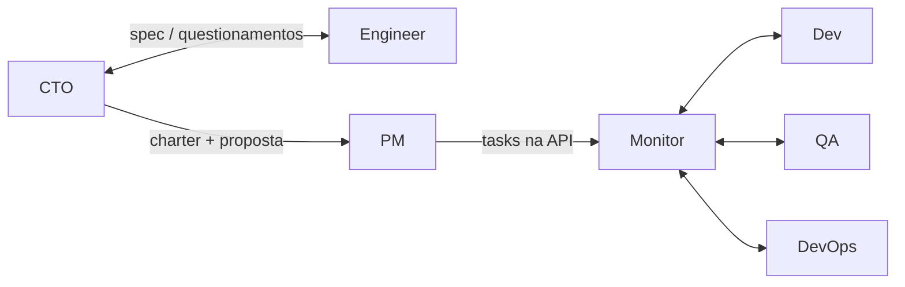

# Pipeline V2 — Contratos de handoff entre agentes

> Referência para o [PIPELINE_V2_AUTONOMOUS_FLOW_PLAN.md](PIPELINE_V2_AUTONOMOUS_FLOW_PLAN.md). Cada agente recebe e entrega no formato abaixo.

---

## Fluxo dos handoffs

---

## CTO → Engineer (entrada)

- **spec_ref:** string (path ou identificador da spec).
- **spec_content:** string (conteúdo da spec em .md; CTO pode ter convertido/normalizado).
- **context:** {} (vazio na primeira chamada; em rodadas de questionamento pode conter `cto_questionamentos`).
- **task:** {}.
- **constraints:** {}.
- **artifacts:** [].

## Engineer → CTO (saída — response_envelope)

- **status:** "OK" | "REVISION" | ...
- **summary:** string (proposta técnica em texto: squads, skills, dependências).
- **artifacts:** lista opcional com itens `{ "purpose": string, "content": string }` (ex.: squads em formato estruturado).
- Para rodadas de questionamento: Engineer recebe em `input.context.cto_questionamentos` (string) e responde no `summary`.

---

## CTO → PM por skill (entrada)

- **spec_ref:** string.
- **context.charter_summary:** string (charter do projeto).
- **context.engineer_proposal:** string (proposta técnica com squads).
- **context.module:** "backend" | "web" | "mobile" (módulo/squad deste PM).
- **task:** {}.
- **constraints:** {}.
- **artifacts:** [].

Em rodadas de questionamento: **context.cto_questionamentos** (string).

## PM → CTO (saída)

- **status:** "OK" | "REVISION".
- **summary:** string (backlog do módulo: tarefas, prioridades, critérios de aceite).
- **artifacts:** lista opcional (ex.: lista de tarefas estruturadas).

---

## PM → Monitor (implícito)

O runner “aciona a squad” criando tasks na API (POST /api/projects/:id/tasks) com module e owner_role. O Monitor (loop no runner) lê essas tasks e orquestra Dev/QA/DevOps.

## Monitor → Dev (entrada)

- **spec_ref**, **context.charter_summary**, **context.backlog_summary**.
- **context.task:** objeto da task atual (task_id, module, requirements, status).
- **artifacts:** artefatos já disponíveis (ex.: spec, charter, backlog em docs).

## Dev → Monitor (saída)

- **status**, **summary** (resumo da implementação).
- **artifacts:** lista com itens `{ "path": string, "content": string, "purpose": string }` para gravar em `project/<project_id>/`.

---

## Monitor → QA (entrada)

- **spec_ref**, **charter_summary**, **backlog_summary**, **dev_summary**.
- **context.task:** task em WAITING_REVIEW.
- **artifacts:** referência aos artefatos do Dev (docs e project/).

## QA → Monitor (saída)

- **status:** "QA_PASS" | "QA_FAIL" | "BLOCKED" etc.
- **summary:** relatório de qualidade; em QA_FAIL deve incluir evidência e ação recomendada.

---

## Monitor → DevOps (entrada)

- **spec_ref**, **charter_summary**, **backlog_summary**.
- **artifacts:** artefatos do Dev (e docs) para gerar Dockerfile/compose.

## DevOps → Monitor (saída)

- **status**, **summary**.
- **artifacts:** lista com `path` (ex.: "Dockerfile", "docker-compose.yml") e `content`. Runner grava em project/ e trata como “provisionamento as if” concluído.

---

## Estados do projeto (runner/API)

| Estado API (projects.status) | Significado no V2 |
|------------------------------|-------------------|
| draft | Sem spec ou não iniciado |
| spec_submitted / pending_conversion | Spec enviada |
| cto_charter | Fase CTO↔Engineer ou CTO↔PM |
| pm_backlog | Backlog(s) sendo gerados/validados |
| running | Squad(s) ativa(s); Monitor Loop em execução |
| completed | Pipeline concluído (todas tasks DONE, DevOps as if) |
| failed | Erro ou falha ao criar tarefas |
| stopped | Usuário parou |
| accepted | Usuário aceitou o projeto |

A API já suporta esses valores; o runner transita entre eles conforme o fluxo V2.
